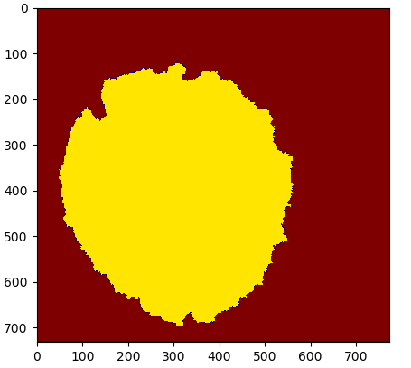
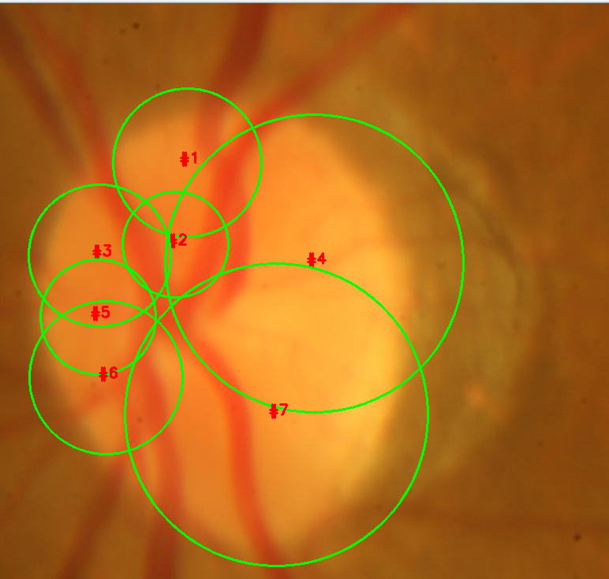
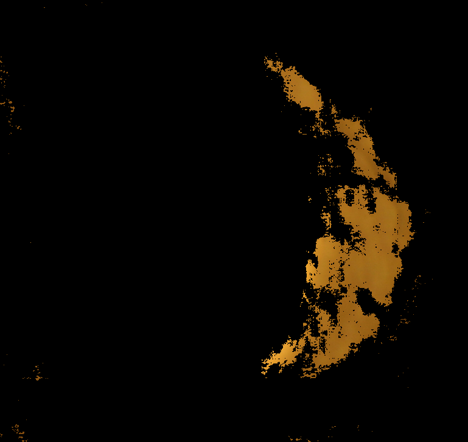
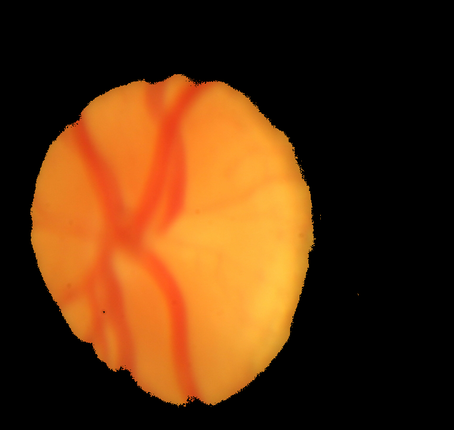
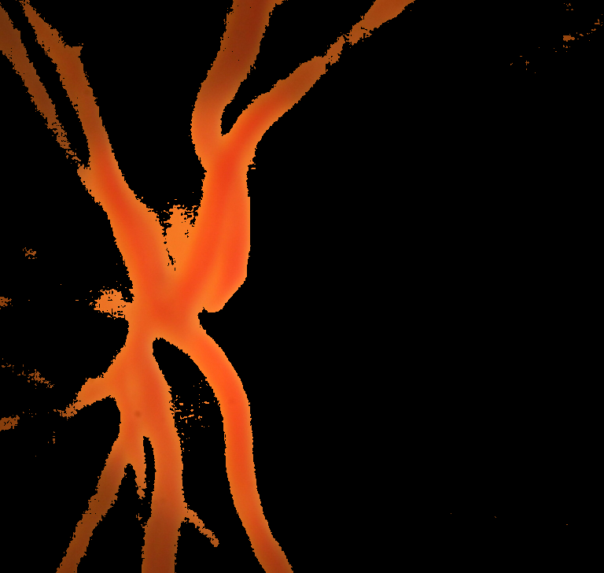
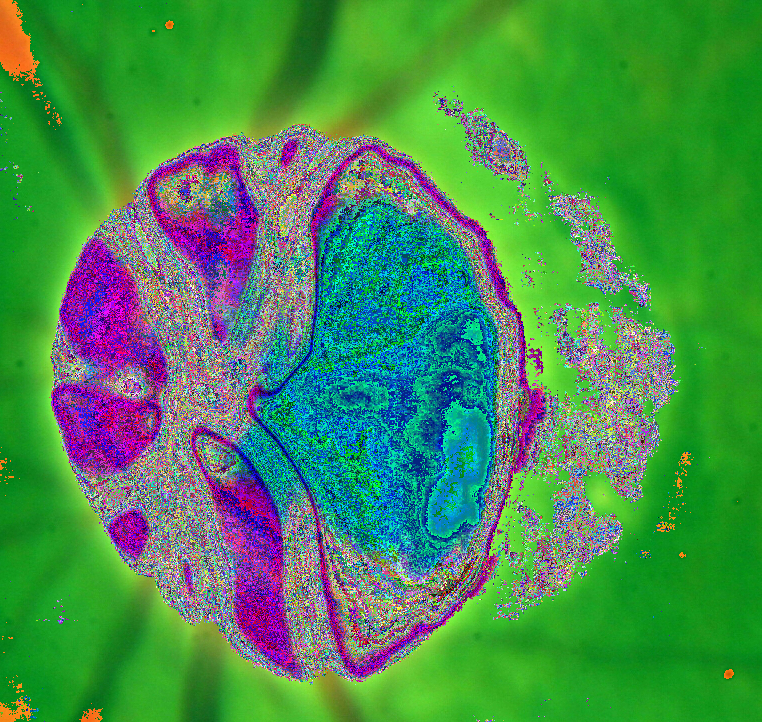
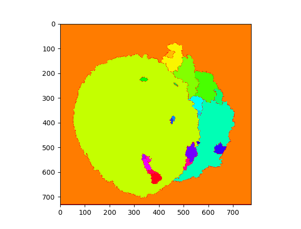

## Segmenting the given image into three different regions
Pseudocode:

```
img = readImage()

// convert to Lab color space and apply proper threshold by tweaking the a-channel value to detect the Atrophy region
img.color_Space_Convert(BGR to L*a*b*)
th1 = apply_Threshold(img) 
res = bitwise_AND(th1, img)

// convert to HLS color space and apply proper threshold by tweaking the l-channel value to detect the Optic Disk region
img.color_Space_Convert(BGR to HLS)
th2 = apply_Threshold(img)
res2 = bitwise_AND(th2, img)

// convert to HSV color space and apply proper threshold by tweaking H and S-channel values to detect and remove the reddish colored crossing
img.color_Space_Convert(BGR to HSV)
th3 = apply_Threshold(img)
res3 = bitwise_XOR(th3, img)

// mask the original image with above three results
result = apply_Mask(img, res, res2, res3)

// apply marker-based watershed algorithm on resulting image
img.color_Space_Convert(BGR to Gray)
th = apply_Threshold(img)

// apply Morphological closing to remove small holes
noise_removed = MorphologyEx(th, MORPH_CLOSE)

// dilate the resulting image to get the sure background area
sure_bg = dilate(noise_removed)

// apply distance transformation on noise_removed image to catch the sure foreground area
dist_transform = apply_Distance_Transformation(noise_removed)
sure_foreground = apply_Threshold(dist_transform)

// subtract the sure foreground area from sure background area to get the unknown region
unknown = sure_background - sure_foreground

// apply connected Components labelling to label sure foreground with some positive integer, sure background with some other positive integer and unknown region with zero
markers = applyConnectedComponentsLabelling(sure_foreground);
markers = markers + 1;
markers[unkown == 255] = 0

// apply watershed to the labelled image to mark the boundary region with -1
markers = apply_Watershed(img, markers)
final_Result = img[markers == -1] = [255, 0, 0]
```

Firstly,  an initial look-up on the image makes it clear that the Optic Disk class, the atrophy class and the background class are all touching each other and hence, the traditional thresholding and contour detection methods would be unable to treat them distinctly.

### A simple approach with the Watershed algorithm

A second thought is the marker-based image segmentation using Watershed algorithm ([naive_watershed.py](https://github.com/Saurav0074/Advenio/blob/master/naive_watershed.py)), which is considered to be very useful in such cases because of its implicit assumption of the image surface being composed of peaks and valleys where high intensity denotes peaks and hills while low intensity denotes valleys; we start by filling water (color) in the valleys and making barriers in order to prevent the merging of peaks with valleys; these barriers eventually form the border-line of segmentation. An additional benifit of this method is the identification of background, foreground as well as the unknown regions which can't be surely classified as either (this fits our case very closely).

The output of applying a naive watershed algorithm to the image:
 
 
 
 The algorithm is okay with the optic disk (the sure foreground class) and background (the sure background) classes but fails to recognise the fainter atrophy class distinctly (which it should have recognised as an unknown region) and instead includes it in the sure-background class.
 
 Next, I went on to see the contours plotted by the above naive watershed algorithm ([finding_Contours.py](https://github.com/Saurav0074/Advenio/blob/master/finding_Contours.py)) in order to find the regions which were being considered distinct by the algorithm. 
 
 
 
 The output observed clarifies the above point as no single contour falls solely within the Atrophy Class region. This indicates that the algorithm somehow can't classify the Atrophy class's pixel intensities, i.e. it treats them similar to the values of the neighboring background class. This led me to my final approach.

### Final approach : Watershed along with color-space conversion 
[colorSpace_with_watershed.py](https://github.com/Saurav0074/Advenio/blob/master/colorSpace_with_watershed.py)

Now, the foremost task is to detect the Atrophy class region. For this purpose, a color-space conversion of the orginial image from RGB to L*a*b* is applied, which shows the Atrophy region being clearly recognised by varying the values of the a-channel. Following is the output with the color range set as `[10, 10, 0] - [185, 146, 255]` (in order to discard the rest of the color regions of the image by bitwise-AND; the range is obtained by manual tweaking of the values):



The last thing I need now is the optic disc class separated from the rest of the image. For this, a color-space conversion from RGB to HLS is made with the color range `[0, 115, 0] - [255, 255, 255]` follwed by a bitwise_AND, giving the following output:



The next step is to mask the above obtained results with the original image to achieve the overall effect. But before that, one more thing to notice in the image is the reddish colored cross-shaped mark extending through the height of the image. In order to extract the mark, I used a RGB to HSV color conversion with the value range `[0,0,0]- [12, 240, 255]`:



To remove the effect of the crossing on the final output, I performed a bitwise-XOR of the above image with that of the original one.
Finally, masking above three results with the original image gives the output:


 


This image can now be passed as input to the watershed algorithm producing the result shown below:
 
 
 
 ### Observation
 
 The final output shows much better results than that of the Naive approach but still has some cons:
 - Some regions of the Atrophy class have been segmented as other distinct regions, however a large portion has been segmented correctly.
 - Few gaps between the Optic Disk and Atrophy region also have been segmented as different ones.

 
